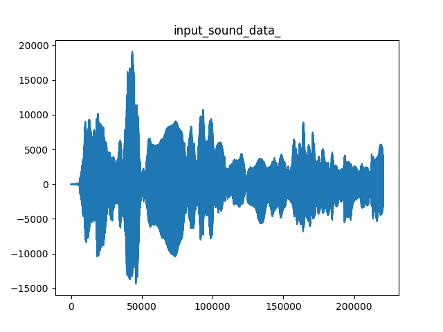
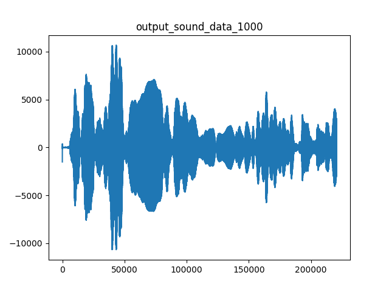
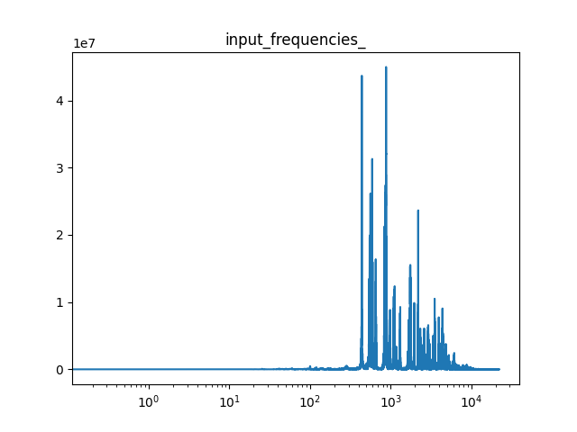
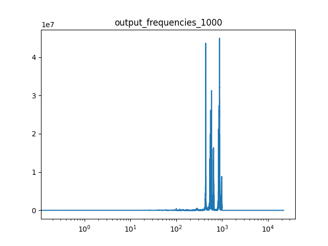

# Tiefpassfilter

### Prüfungsleistung für Digitale Sprachverarbeitung an der DHBW Karlsruhe

### Gruppe: Florian Babel, Johannes Welsch, Tom Witzel

## Benutzung
- _main.py_ mit Parametern ausführen
  - Ohne Parameter wird 1000Hz und violin.wav gewählt
  - Der erste Parameter ist die Frequenz in Hz
  - Der zweite Parameter der Dateiname des Inputs ohne Endung oder Pfadangabe
    - Die Datei muss in _res/_ liegen
    - Das working Directory muss _src/_ sein. Über die Konsole ist das Standard, aber in einer IDE muss das beachtet werden
  - Eine Eingabe könnte folgendermaßen aussehen

    ```python tiefpassfilter.py 10_000 oboe```
  - Die generierte Audiodatei wird gemeinsam mit den Graphen in out/ gespeichert 

## Funktion
Der Tiefpassfilter wurde mithilfe einer Fourier Analyse durchgeführt, da so einfach ein Frequenzband errechnet wird, in dem die Frequenzen bearbeitet werden können. Nach der Bearbeitung kann aus den Frequenzen mit einer inversen Fourier Transformation ein Audiosignal wiederhergestellt werden.
Um die Frequenzen an der richtigen Stelle (Index) zu bearbeiten, muss die Zielfrequenz umgerechnet werden. Zunächst werden die frequency_steps durch die Funktion rfftfreq() geliefert. Aus denen wird berechnet wie viele Punkte/Indizes eine Frequenz sind. Der Zielindex berechnet sich dann aus der Multiplikation von der Zielfrequenz mit den Indizes pro Frequenz.
Ab diesem Index werden alle Werte in den Frequenzen null gesetzt. Durch Inverse Fourier Transformation wird der Output erzeugt.
Vor und nach dem Bearbeiten wird die Audiodatei und die Frequenzen mithilfe der matplotlib visualisiert. Dafür werden die Frequenzen auf die y-Achse aufgetragen und die Frequenzschritte auf die x-Achse.
An den meisten Stellen wurden die reellen Fourier Funktionen (_rfft_) benutzt, da diese bei einer reellen Eingabe nur halb so viel ausrechnen und somit schneller sind. Bei dem Output gab es damit aber einen Fehler, der bei bestimmten Dateien auftritt. Die _violin.wav_ ist ohne Probleme durchgelaufen. Die _oboe.wav_ hat an der Stelle, aber einen Fehler geworfen. Mit der normalen Fourier Funktion (_fft_) tritt dieser Fehler nicht auf. Die _oboe.wav_ scheint anders aufgebaut zu sein, als die _violin.wav_.
In den untenstehenden Abbildungen kann man für eine Beispieldatei zunächst die Sounddaten sehen, die sich nicht wirklich unterscheiden. Bei den Frequenzen lässt sich ein klarer Schnitt bei 1000Hz (10<sup>3</sup>) erkennen. 





