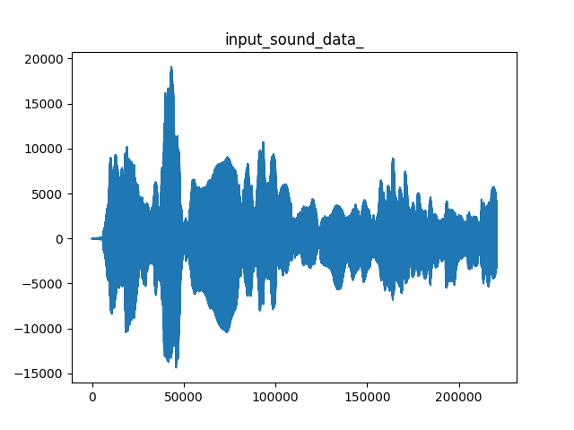
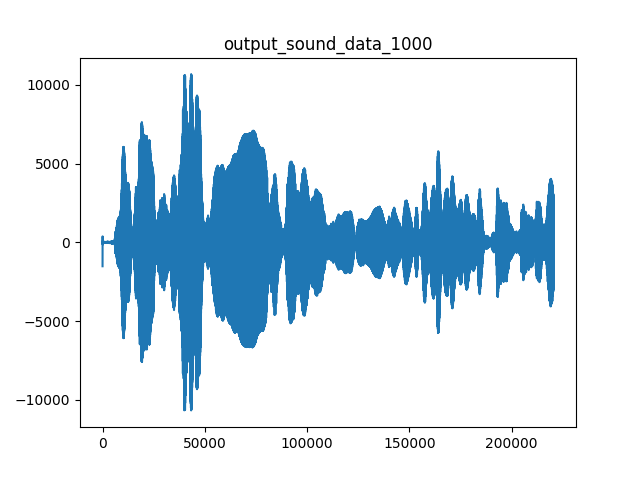
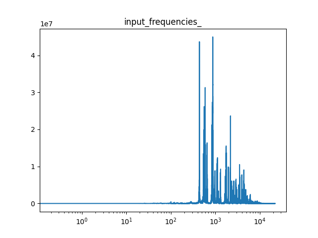
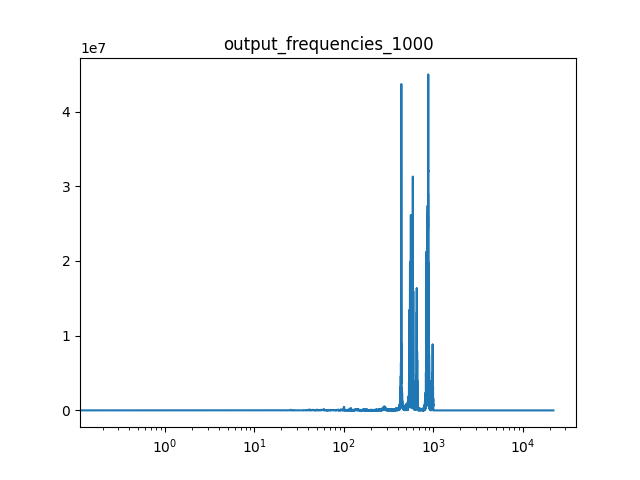

# Tiefpassfilter
Gruppe: Florian Babel, Johannes Welsch, Tom Witzel

Der Tiefpassfilter wurde mithilfe einer Fourier Analyse durchgeführt, da so einfach ein Frequenzband errechnet wird, in dem die Frequenzen bearbeitet werden können. Nach der Bearbeitung kann aus den Frequenzen mit einer inversen Fourier Transformation ein Audiosignal wiederhergestellt werden.
Um die Frequenzen an der richtigen Stelle (Index) zu bearbeiten, muss die Zielfrequenz umgerechnet werden. zunächst werden die frequency_steps durch die Funktion rfftfreq() geliefert. Aus denen wird berechnet wie viele Punkte/Indizes eine Frequenz sind. Der Zielindex berechnet sich dann aus der multiplikation von der Zielfrequenz mit den Indizes pro Frequenz.
Ab diesem Index werden alle Werte in den Frequenzen null gesetzt. Durch Inverse Fourier Transformation wird der Output erzeugt.
Vor und nach dem Bearbeiten wird die Audiodatei und die Frequenzen mithilfe der matplotlib visualisiert. Dafür werden die Frequenzen auf die y-Achse aufgetragen und die Frequenzschritte auf die x-Achse.
In den untenstehenden Abbildungen kann man für eine Beispieldatei zunächst die Sounddaten sehen, die sich nicht wirklich unterscheiden. Bei den Frequenzen lässt sich ein klarer Schnitt bei 1000 Hz erkennen. 

